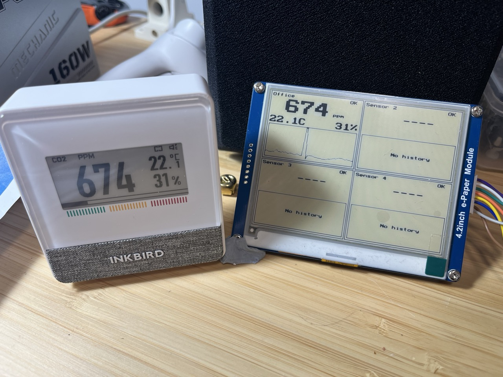

# CO2 Display Project

> **Status: 🚧 Work in Progress**

ESP32-based CO2 sensor display with BLE connectivity to Inkbird IAM-T1 sensors.



## Overview

This project creates a standalone air quality monitor that:

- Connects to up to 4 Inkbird IAM-T1 CO2 sensors via Bluetooth Low Energy
- Displays real-time CO2, temperature, and humidity on a 4.2" e-paper display
- Downloads and displays historical CO2 trends from sensor memory
- Shows air quality status indicators (Good / Moderate / Warning / Alert)

## Hardware

### Components

| Component | Model | Notes |
|-----------|-------|-------|
| MCU | ESP32-C3-DevKitM-1 | ESP32-C3 with built-in BLE |
| Display | Waveshare 4.2" B/W E-Paper | 400x300 pixels, SPI interface |
| Sensors | Inkbird IAM-T1 | BLE CO2/temp/humidity monitors (up to 4) |

### Wiring (ESP32-C3 → E-Paper)

| ESP32-C3 | E-Paper | Function |
|----------|---------|----------|
| GPIO 7 | DIN | SPI MOSI |
| GPIO 6 | CLK | SPI Clock |
| GPIO 10 | CS | Chip Select |
| GPIO 1 | DC | Data/Command |
| GPIO 0 | RST | Reset |
| GPIO 3 | BUSY | Busy Status |
| 3.3V | VCC | Power |
| GND | GND | Ground |

## Features

- **Multi-sensor support** - Monitor up to 4 rooms/locations simultaneously
- **BLE communication** - Wireless connection to Inkbird IAM-T1 sensors
- **Real-time readings** - CO2 (ppm), temperature (°C), humidity (%)
- **History sync** - Downloads stored readings from sensor memory on startup
- **Trend charts** - Mini CO2 history graphs for each sensor (last 60 readings)
- **Status indicators** - Visual air quality levels based on CO2 thresholds
- **Loading screen** - Progress feedback during sensor initialization
- **Synthetic data mode** - Test UI without physical sensors
- **Low power display** - E-paper only draws power during refresh

## Project Structure

```
co2_display/
├── src/
│   ├── main.c                 # Application entry point
│   ├── ble/                   # BLE client for Inkbird sensors
│   │   ├── inkbird_ble.c/h    # BLE connection & data parsing
│   │   └── inkbird_config.h   # Sensor MAC addresses & settings
│   ├── drivers/               # Hardware drivers
│   │   ├── epd_driver.c/h     # E-paper display driver (SPI)
│   │   └── gfx.c/h            # Graphics library (fonts, shapes, charts)
│   ├── ui/                    # User interface
│   │   └── ui_co2_display.c/h # 2x2 sensor grid layout
│   └── data/                  # Data management
│       ├── sensor_data.c/h    # Sensor readings & history buffers
│       └── synthetic_data.c/h # Fake data generator for testing
├── platformio.ini             # PlatformIO configuration
├── sdkconfig.defaults         # ESP-IDF SDK defaults
├── INKBIRD_IAM_T1_PROTOCOL.md # BLE protocol documentation
└── AGENTS.md                  # Development guidelines
```

## Architecture

### Module Overview

| Module | Purpose |
|--------|---------|
| `main.c` | Startup sequence, FreeRTOS timers, task orchestration |
| `ble/` | NimBLE-based client for Inkbird sensors (scan, connect, read, history) |
| `drivers/` | Low-level hardware: SPI e-paper driver + bitmap graphics library |
| `ui/` | Display layout: 2x2 grid with CO2 values, status, and mini charts |
| `data/` | Sensor data storage with ring buffers for history |

### Startup Sequence

1. **Initialize hardware** - E-paper display, BLE stack
2. **Show loading screen** - Immediate visual feedback
3. **Phase 1: Read current values** - Connect to each sensor, get real-time reading
4. **Phase 2: Display values** - Refresh e-paper with current data
5. **Phase 3: Sync history** - Download stored readings from sensor memory
6. **Phase 4: Periodic updates** - Start background polling task

## Configuration

### Adding Sensors

1. **Discover sensors** - The device scans for Inkbird sensors on first boot. Check serial output for discovered MAC addresses.

2. **Edit configuration** - Update `src/ble/inkbird_config.h`:
   ```c
   static const inkbird_sensor_config_t INKBIRD_SENSORS[INKBIRD_SENSOR_COUNT] = {
       {
           .mac = {0x62, 0x00, 0xA1, 0x35, 0x94, 0x2B},  // Your sensor MAC
           .name = "Office",
           .enabled = true
       },
       // ... add more sensors
   };
   ```

3. **Rebuild and flash** - `pio run -t upload`

### Testing Without Sensors

Set `USE_SYNTHETIC_DATA` to `true` in `src/main.c` to use generated test data:

```c
#define USE_SYNTHETIC_DATA  true
```

## Build & Flash

### Prerequisites

- [PlatformIO](https://platformio.org/) (CLI or IDE)
- USB cable connected to ESP32-C3

### Commands

```bash
# Build
pio run

# Build and upload
pio run -t upload

# Monitor serial output (115200 baud)
pio device monitor

# Build, upload, and monitor
pio run -t upload && pio device monitor

# Clean build
pio run -t clean

# Full clean (including dependencies)
pio run -t fullclean

# Open ESP-IDF menuconfig
pio run -t menuconfig
```

## Testing

```bash
# Run unit tests
pio test

# Run specific test
pio test -f test_<name>

# Static analysis
pio check
```

See [AGENTS.md](AGENTS.md) for detailed coding guidelines and test conventions.

## Troubleshooting

### Build Issues

**Build fails after config change:**
```bash
pio run -t fullclean
pio run
```

### Upload Issues

**Upload fails:**
- Check USB connection
- Hold BOOT button while uploading
- Verify correct USB port

**Serial monitor garbled:**
- Ensure baud rate is 115200
- Reset ESP32 after upload

### BLE Issues

**No sensors found:**
- Ensure Inkbird IAM-T1 is powered on (check battery)
- Move closer to sensor (BLE range ~10m)
- Check serial log for scan results

**Connection fails:**
- Reset the sensor (remove and reinsert battery)
- Close the Inkbird mobile app if running (only one connection allowed)
- Check MAC address matches in `inkbird_config.h`

**Data not updating:**
- Sensor sends data every ~1-2 minutes after connection
- Check `stale` flag timeout in config (default 3 minutes)

### Memory Issues

**Out of memory:**
- Reduce task stack sizes
- Check heap usage: `esp_get_free_heap_size()`

## Protocol Documentation

See [INKBIRD_IAM_T1_PROTOCOL.md](INKBIRD_IAM_T1_PROTOCOL.md) for detailed BLE protocol documentation (reverse-engineered from Android APK).

## License

[Add your license here]

## Credits

- Inkbird IAM-T1 protocol reverse-engineered from Android APK
- ESP-IDF framework by Espressif
- Waveshare e-paper driver adapted from official Arduino examples
